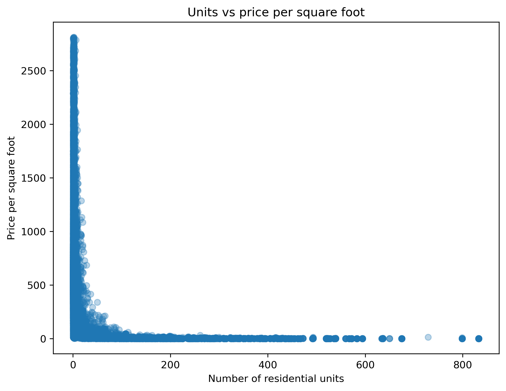
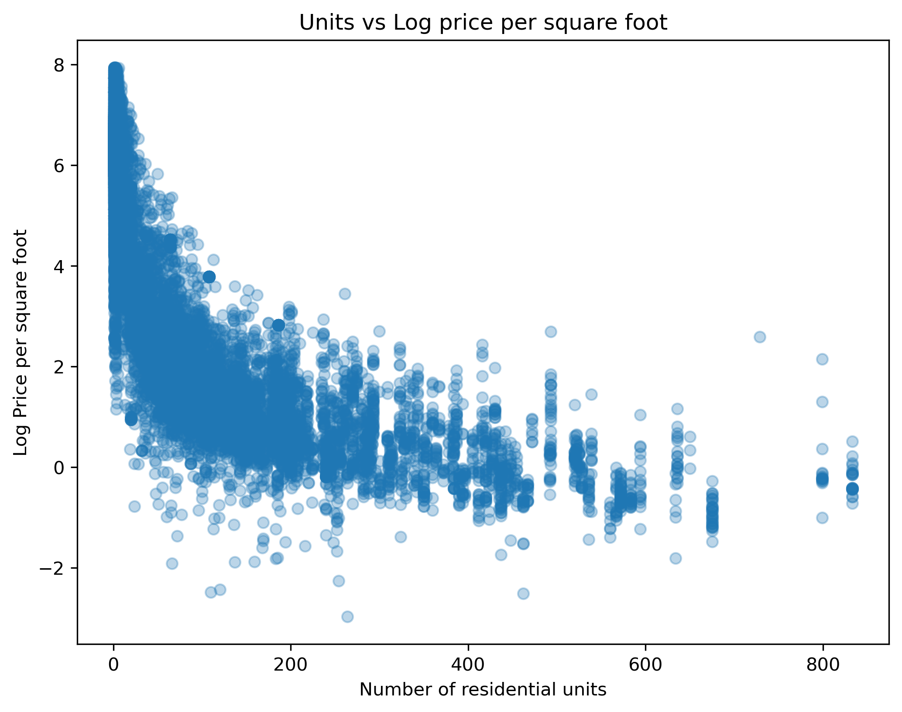
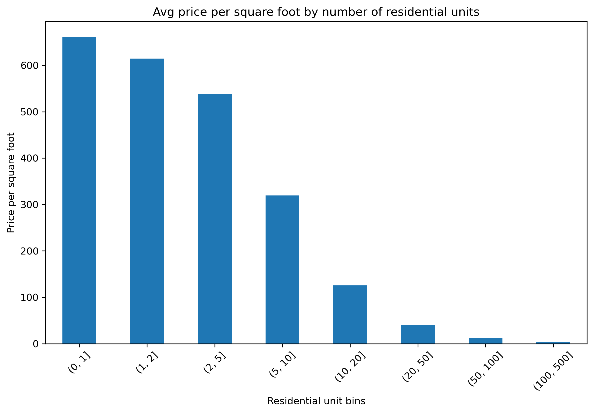
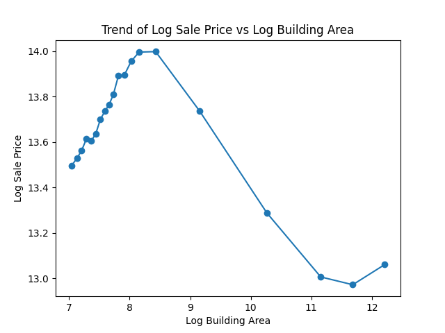
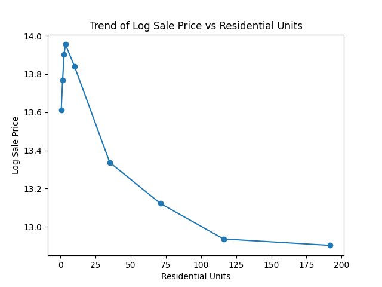

# Data-Science-NYC-Housing-Project
Nico Bonanno, Jake Samela, Emraan Kafihi

This is the final project for our Data Science Fundamentals course (COMP 3125) at Wentworth Institute of Technology. Our project is analyzing New York City housing data to determine the impact of various building characteristics on the sale price of a property.

## Introduction
#### Why was the project undertaken?
We chose to do our project on this topic because we had a shared interest in economics, and housing prices are a significant facet of the economy. We wanted to apply the techniques learned in class to a meaningful, real-world dataset in order to understand how various building characteristics influence housing prices in New York City.

#### Research Questions:
1) Do sale prices differ significantly by borough?
2) Does the number of residential units affect sale price per square foot?
3) Is zip code a determinant of sale price?
4) Does building age affect sale price?
5) How are building area and residential units associated with sale price?

#### Purpose:
The purpose of our research was to determine the answers to the above questions and to gather information on the housing situation in New York City, one of the largest cities in the world. We aimed to test whether factors such as location and building characteristics have a measurable impact on sale price. 

## Selection of Data
We selected a dataset from Kaggle titled NYC Housing Prices. The dataset is included in this repo and can also be found here: https://www.kaggle.com/datasets/ishank2005/nyc-housing-prices-csv.

We chose this dataset because it is large and contains many useful features related to property characteristics and location. The dataset originally contained 34,439 rows, of which 236 were dropped due to missing values (NaN). After cleaning, the dataset contained 34,203 rows.

The dataset contains 19 columns, which are:
borough_x, block, lot, sale_price, zip_code, borough_y, yearbuilt, lotarea, bldgarea, resarea, comarea, unitsres, unitstotal, numfloors, latitude, longitude, landuse, bldgclass, and building_age.

#### Data Preview

#### Data Cleaning/Feature Engineering
We created one additional feature to improve the analysis:
- Price per square foot, calculated as sale price divided by building area.

The data was cleaned by removing all rows with missing values. This resulted in the removal of 236 rows, representing only about 0.7% of the dataset, so the impact on the overall dataset was minimal.

Additionally, several columns including zip_code, yearbuilt, and numfloors were converted from float values to integers to better represent categorical identifiers and count-based variables. We also verified that there were no rows containing negative sale prices or building areas less than or equal to zero, ensuring the data was valid for analysis.

## Methods
#### Tools:
- Python for writing code
- Pandas and Numpy for data analysis and manipluation
- Matplotlib for creating visuals
- Scikit-learn (sklearn) for implementing the linear regression model
- Github for version control
- VS Code as IDE

#### Analytical Methods
To answer the research questions, we used techniques including grouping, filtering, and aggregation using the Pandas library. Visualizations were created using Matplotlib to compare property characteristics across boroughs and other variables. For the machine learning component of the project, a linear regression model was applied to analyze the relationship between building characteristics and sale price. The model was used to examine how selected variables are associated with housing prices rather than to make predictions.

#### Research Question Distribution
- RQ1: Nico
- RQ2: Jake
- RQ3: Emraan
- RQ4: Emraan
- RQ5: Nico

## Results
#### Research Question 1: Do sale prices differ significantly by borough?
To answer this question, we calculated both the median and average sale prices for properties in each of the five boroughs.

The results show clear differences in property values across the boroughs. Manhattan and Brooklyn have higher median sale prices compared to the Bronx, Queens, and Staten Island. A similar pattern appears when examining the average sale prices, where Manhattan and Brooklyn also have the highest values among the five boroughs. These results indicate that property sale prices vary across boroughs in New York City.

#### Research Question 2: Does the number of residential units affect sale price per square foot?
To answer this question, the first thing we did was create a sale price per square foot metric. This was done by taking the sale price and dividing it by the building area. There are three plots shown below to analyze this. First is the units vs price per square foot, the second is the same scatterplot, but with the log of the price per square foot to reduce skewness. The last is a bin model of the number of residential units that are binned in 0, 1, 2, 5, 10, 20, 50, 100, and 500, and plotted is the resulting output of price per square foot.

As illustrated by these results, as the number of residential units increases the price decreases. This trend is present in all three of the figures. This pattern may be explained by real-world factors. Intuitively, people may prefer to live in less densely populated environments, even within a city, which can lead to higher prices per square foot for properties with fewer residential units.

#### Research Question 3: Is zip code a determinant of sale price?
To answer this question, we calculated both the median and average sale prices for properties within the top 20 ZIP codes by sales volume. The dataset contains 180 unique ZIP codes, and plotting all of them would produce an overly cluttered visualization. Therefore, the analysis focuses on the 20 ZIP codes with the highest sales volume.

The results show clear variation in property values across ZIP codes. Many of the ZIP codes with the highest median and average sale prices fall within the 100xx and 112xx ranges, which correspond to Manhattan and Brooklyn, while ZIP codes from other boroughs generally show lower property values.

#### Research Question 4: Does building age affect sale price?

#### Research Question 5: How are building area and residential units associated with sale price?
To answer this question, we applied a linear regression model to examine the relationship between building area, number of residential units, and sale price. The log of the sale price was used as the response variable. We also used the log of building area as one of the predictors. The log values of these variables were used to reduce skewness.

The regression model included two predictor variables:

- log of building area
- number of residential units (unitsres)

The regression coefficients show that building area has a positive relationship with sale price, while the number of residential units has a negative relationship. This indicates that, holding other factors constant, larger buildings tend to be associated with higher sale prices, while properties with more residential units tend to have lower sale prices per property.

The figure above shows the relationship between building area and sale price using a binned trend plot. As building area increases, sale price generally increases as well. However, the relationship is somewhat noisy, especially for very large buildings, where there are fewer observations.

The figure above shows the relationship between the number of residential units and sale price. As the number of residential units increases, the sale price generally decreases. This pattern is more consistent than the building area relationship and suggests that properties with more units tend to have lower sale prices per property.

Overall, the regression results indicate that both building area and residential units are associated with sale price. Building area shows a positive relationship, while residential units show a negative relationship. Although the relationships are not perfectly linear, the model provides a clear and interpretable view of how these building characteristics relate to housing prices.

## Discussion

## Summary
