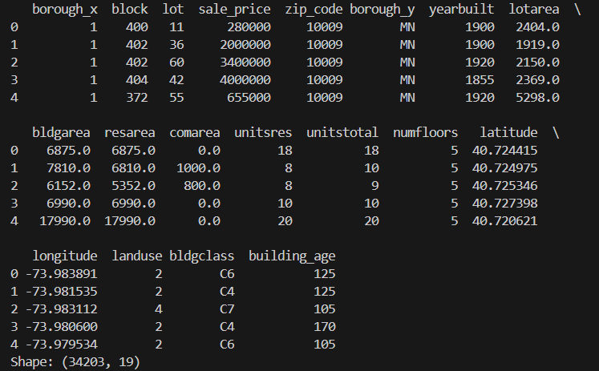
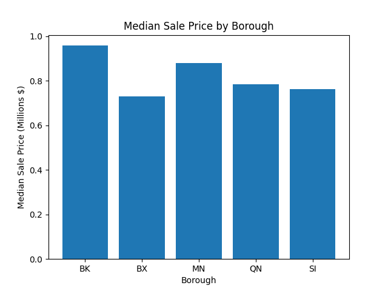
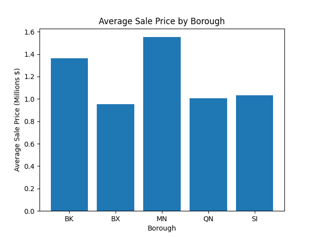
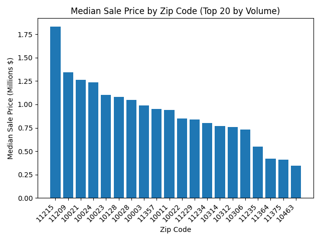
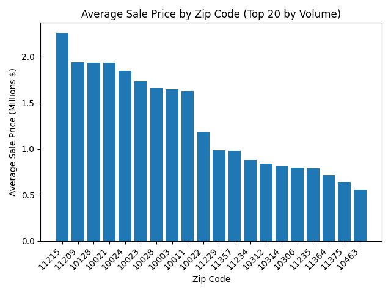
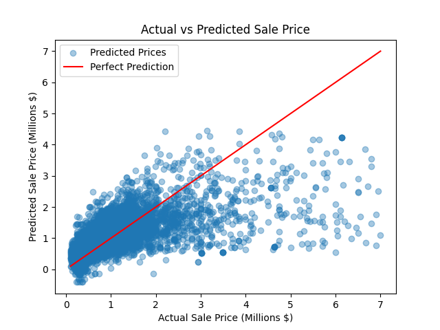

# Data-Science-NYC-Housing-Project
Nico Bonanno, Jake Samela, Emraan Kafihi

This is the final project for our Data Science Fundamentals course (COMP 3125) at Wentworth Institute of Technology. Our project is analyzing New York City housing data to determine the impact of various building characteristics on the sale price of a property.

## Introduction
#### Why was the project undertaken?
We chose to do our project on this topic because we had a shared interest in economics, and housing prices are a significant facet of the economy. We wanted to apply the techniques we have learned in class and through research to a meaningful, real-world project that would allow us to understand the role some of the factors outlined below play in the housing market.

#### Research Questions:
1) Do sale prices differ significantly by borough?
2) Does the number of residential units affect sale price per square foot?
3) Is zip code a determinant of sale price?
4) Does building age affect sale price?
5) Can we accurately predict the sale price using building characteristics?

#### Purpose:
The purpose of our research was to determine the answers to the above questions and to gather information on the housing situation in New York City, one of the largest cities in the world. We wanted to test whether some of these factors such as the borough and the building age of the house had an impact on sale price. 

## Selection of Data
We selected a datsaet from Kaggle titled NYC Housing Prices. The dataset is included in this repo and can also be found here: https://www.kaggle.com/datasets/ishank2005/nyc-housing-prices-csv.

We chose this dataset because it is large and contains many useful features related to property characteristics and location. The dataset originally contained 34,439 rows, of which 236 were dropped due to missing values (NaN). After cleaning, the dataset contained 34,203 rows.

The dataset contains 19 columns, which are:
borough_x, block, lot, sale_price, zip_code, borough_y, yearbuilt, lotarea, bldgarea, resarea, comarea, unitsres, unitstotal, numfloors, latitude, longitude, landuse, bldgclass, and building_age.

#### Data Preview

#### Data Cleaning/Feature Engineering
We created one additional feature to improve the analysis:
- Price per square foot, calculated as sale price divided by building area.

The data was cleaned by removing all rows with missing values. This resulted in the removal of 236 rows, representing only about 0.7% of the dataset, so the impact on the overall dataset was minimal.

Additionally, several columns including zip_code, yearbuilt, and numfloors were converted from float values to integers to better represent categorical identifiers and count-based variables. We also verified that there were no rows containing negative sale prices or building areas less than or equal to zero, ensuring the data was valid for analysis.

## Methods
#### Tools:
- Python for writing code
- Pandas and Numpy for data analysis and manipluation
- Matplotlib for creating visuals
- Github for version control
- VS Code as IDE

#### Analytical Methods
To answer the research questions, we used techniques including grouping, filtering, and aggregation using the Pandas library. Visualizations were created using Matplotlib to compare property characteristics across boroughs and other variables. For the machine learning component of the project, a regression model will be applied to analyze the relationship between building characteristics and sale price. (we can adjust this as we go).

#### Research Question Distribution
- RQ1: Nico
- RQ2: Jake
- RQ3: Emraan
- RQ4: 
- RQ5: Nico

## Results
#### Research Question 1: Do sale prices differ significantly by borough?
To answer this question, we calculated both the median and average sale prices for properties in each of the five boroughs.

The results show clear differences in property values across the boroughs. Manhattan and Brooklyn have higher median sale prices compared to the Bronx, Queens, and Staten Island. A similar pattern appears when examining the average sale prices, where Manhattan and Brooklyn also have the highest values among the five boroughs. These results indicate that property sale prices vary across boroughs in New York City.

#### Research Question 2: Does the number of residential units affect sale price per square foot?

#### Research Question 3: Is zip code a determinant of sale price?
To answer this question, we calculated both the median and average sale prices for properties within the top 20 ZIP codes by sales volume. The dataset contains 180 unique ZIP codes, and plotting all of them would produce an overly cluttered visualization. Therefore, the analysis focuses on the 20 ZIP codes with the highest sales volume.

The results show clear variation in property values across ZIP codes. Many of the ZIP codes with the highest median and average sale prices fall within the 100xx and 112xx ranges, which correspond to Manhattan and Brooklyn, while ZIP codes from other boroughs generally show lower property values.

#### Research Question 4: Does building age affect sale price?

#### Research Question 5: Can we accurately predict the sale price using building characteristics?
To address this question, we trained a linear regression model to predict the sale price of a property based on several building characteristics from the dataset.

Before training the model, we performed additional preprocessing steps to improve the stability of the regression. We removed extreme outliers by filtering out the top and bottom 1% of sale prices, prices per square foot, and building area. These steps helped reduce the influence of unusually priced and sized properties that could distort the regression results.

The following features were used as predictors in the regression model:

- bldgarea (building area)
- lotarea (lot area)
- building_age
- unitsres (number of residential units)
- numfloors
- resarea (residential floor area)
- comarea (commercial floor area)
- price_per_sqft (engineered feature representing sale price divided by building area)
- borough_x
- zip_code

The dataset was then split into training and testing sets using an 80/20 train-test split. The regression model was trained on the training data and used to generate predictions for the testing data.

The performance of the model was evaluated using the R² score and Root Mean Squared Error (RMSE).

The model achieved:

R² Score: 0.3756
RMSE: $739,950

The following figure shows a comparison between the actual sale prices and the predicted sale prices generated by the regression model.

The scatter plot above compares the actual sale prices with the predicted sale prices generated by the regression model. The red line represents perfect predictions, where the predicted value would equal the actual sale price. Overall, the model demonstrates a moderate ability to predict housing prices based on the selected building characteristics, as reflected by the reported R² score and RMSE.

## Discussion

## Summary
